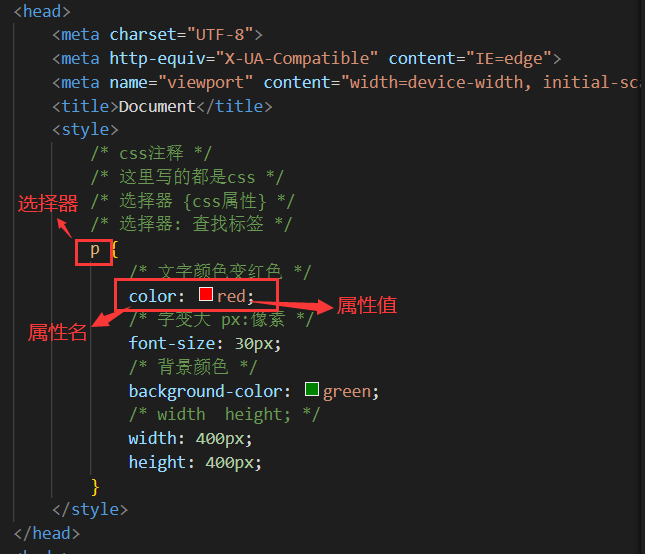

# 
1 CSS简介

## 1.1 CSS 介绍

- CSS 是层叠样式表 ( Cascading Style Sheets ) 的简称，有时我们也会称之为 CSS 样式表或级联样式表
- CSS 是也是一种标记语言
- CSS 主要用于设置 HTML 页面中的文本内容（字体、大小、对齐方式等）、图片的外形（宽高、边框样式、边距等）以及版面的布局和外观显示样式
- CSS写在哪里？
  - css写在style标签中，style标签一般写在head标签里面，title标签下面（这是CSS的其中一种写法，后续还会讲其他写法）

  

- 注意点：
  - CSS 标点符号都是英文状态下的
  - 每一个样式键值对写完之后，最后需要写分号

## 1.2 CSS 引入方式

- 内嵌式：CSS 写在style标签中，style标签虽然可以写在页面任意位置，但是通常约定写在 head 标签中
- 外联式：CSS 写在一个单独的.css文件中，需要通过link标签在网页中引入
- 行内式：CSS 写在标签的style属性中，之后会配合js使用

      

- CSS常见三种引入方式的特点区别有哪些（书写位置、作用范围、使用场景） ？

| 引入方式 |                 书写位置                 | 作用范围 |  使用场景  |
| :------: | :--------------------------------------: | :------: | :--------: |
|  内嵌式  |            CSS写在style标签中            | 当前页面 |   小案例   |
|  外联式  | CSS写在单独的css文件中，通过link标签引入 | 多个页面 |   项目中   |
|  行内式  |         CSS写在标签的style属性中         | 当前标签 | 配合js使用 |

