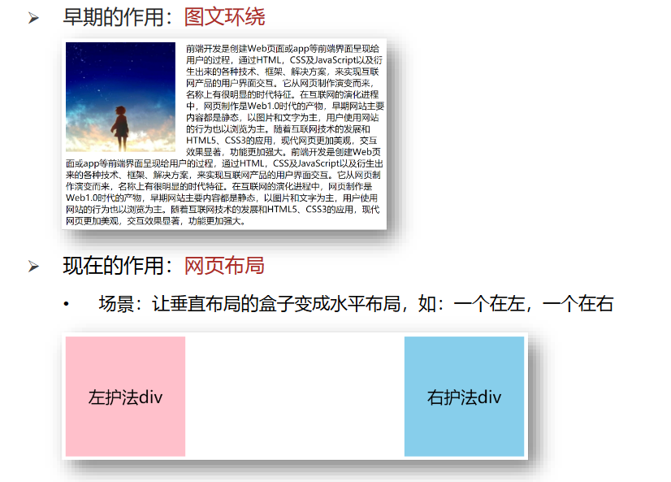
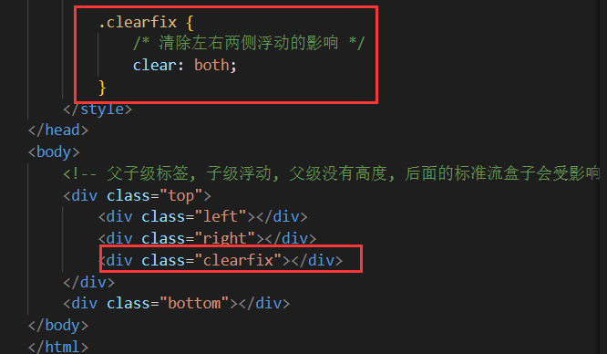
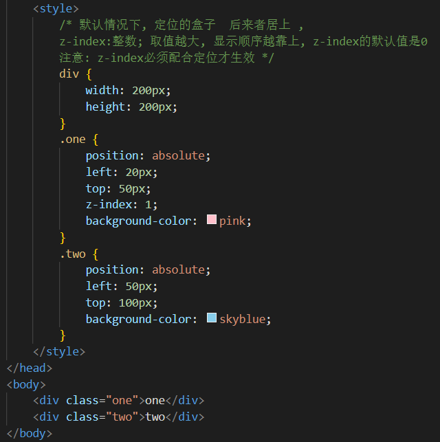
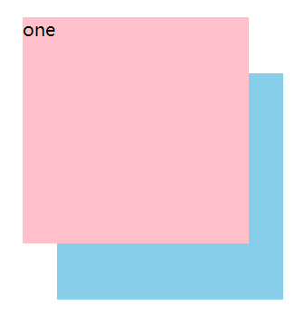

# 
11 CSS 布局

&emsp;&emsp;网页布局的本质——用 CSS 来摆放盒子，把盒子摆放到相应位置，简单说，就是盒子如何进行排列顺序。CSS提供了三种传统布局方式：普通流（标准流）丶浮动和定位

## 11.1 标准流

- 标准流：又称文档流，是浏览器在渲染显示网页内容时默认采用的一套排版规则，规定了应该以何种方式排列元素
- 常见标准流排版规则：
  1. 块级元素：从上往下，垂直布局，独占一行
  2. 行内元素 或 行内块元素：从左往右，水平布局，空间不够自动折行
- 实际开发中，一个页面基本都包含了这三种布局方式（后面移动端学习新的布局方式）

## 11.2 浮动

### 11.2.1 浮动介绍

- 浮动的作用
  - 早期的作用：图文环绕
  - 现在的作用：网页布局，让垂直布局的盒子变成水平布局，如：一个在左，一个在右

  

- 属性名：float
- 属性值：

| 属性名 |  效果  |
| :----: | :----: |
|  left  | 左浮动 |
| right  | 右浮动 

- 浮动的特点
  - 浮动元素会脱离标准流（简称：脱标），在标准流中不占位置
  - 浮动元素比标准流高半个级别，可以覆盖标准流中的元素
  - 浮动找浮动，下一个浮动元素会在上一个浮动元素后面左右浮动
  - 浮动元素有特殊的显示效果：一行可以显示多个；可以设置宽高
- 浮动的元素是互相贴靠在一起的（不会有缝隙），如果父级宽度装不下这些浮动的盒子， 多出的盒子会另起一行对齐
- 浮动的元素不能通过 text-align:center 或者 margin:0 auto 进行居中

### 11.2.2 清除浮动

- 为什么需要清除浮动？
  - 由于父级盒子很多情况下，不方便给高度，但是子盒子浮动又不占有位置，最后父级盒子高度为 0 时，就会影响下面的标准流盒子
  - 由于浮动元素不再占用原文档流的位置，所以它会对后面的元素排版产生影响

- 清除浮动本质
  - 清除浮动的本质是清除浮动元素造成的影响
  - 如果父盒子本身有高度，则不需要清除浮动
  - 清除浮动之后，父级就会根据浮动的子盒子自动检测高度。父级有了高度，就不会影响下面的标准流了

- 清除浮动策略：闭合浮动，只让浮动在父盒子内部影响,不影响父盒子外面的其他盒子

### 11.2.3 清除浮动的方法

- 额外标签法
  - 操作：在父元素内容的最后添加一个块级元素，然后给添加的块级元素设置 `clear:both`
  - 缺点：会在页面中添加额外的标签，会让页面的HTML结构变得复杂

| 属性值 |                   描述                    |
| :----: | :---------------------------------------: |
|  left  | 不允许左侧有浮动元素（清除左侧浮动的影响) |
| right  | 不允许右侧有浮动元素（清除右侧浮动的影响) |
|  both  |        同时清除左右两侧浮动的影响         |

  

- 单伪元素法
  - 操作：给父元素添加`clearfix`类
  - 优点：项目中使用，直接给标签加类即可清除浮动

~~~css
.clearfix::after {
    content: "";
    display: block;
    height: 0;
    clear: both;
    visibility: hidden;
}
~~~

- 双伪元素法
  - 操作：给父元素添加`clearfix`类
  - 优点：项目中使用，直接给标签加类即可清除浮动

~~~css
.clearfix::before,.clearfix::after {
    content:"";
    display:table;
}
.clearfix::after {
    clear:both;
}
~~~

- overflow
  - 操作：可以给父级添加 overflow 属性，将其属性值设置为 hidden、 auto 或 scroll
  - 优点：代码简洁
  - 缺点：无法显示溢出的部分

## 11.3 定位

### 11.3.1 定位介绍

- 定位：将盒子定在某一个位置，所以定位也是在摆放盒子， 按照定位的方式移动盒子
- 定位的作用：定位是可以让盒子自由的在某个盒子内移动位置或者固定屏幕中某个位置，并且可以压住其他盒子
- 定位组成
  - 定位 = 定位模式 + 边偏移
  - 定位模式用于指定一个元素在文档中的定位方式。边偏移则决定了该元素的最终位置

- 定位模式决定元素的定位方式 ，它通过 CSS 的 position 属性来设置，其值可以分为四个

|    值    |   语义   |
| :------: | :------: |
|  static  | 静态定位 |
| relative | 相对定位 |
| absolute | 绝对定位 |
|  fixed   | 固定定位 |

- 边偏移就是定位的盒子移动到最终位置。有 top、bottom、left 和 right 4 个属性。当同时写了4个属性，只有left和top会生效

| 边偏移属性 |     示例     |                       描述                       |
| :--------: | :----------: | :----------------------------------------------: |
|    top     |  top: 80px   |  顶端偏移量，定义元素相对于其父元素上边线的距离  |
|   bottom   | bottom: 80px | 底部偏移量，定义元素相对于其父元素下边线的距离。 |
|    left    |  left: 80px  |  左侧偏移量，定义元素相对于其父元素左边线的距离  |
|   right    | right: 80px  |  右侧偏移量，定义元素相对于其父元素右边线的距离  |

### 11.3.2 静态定位 static

- 静态定位是元素的默认定位方式，无定位的意思
- 语法：`position: static;`
- 静态定位按照标准流特性摆放位置，它没有边偏移，静态定位在布局时很少用到

### 11.3.3 相对定位 relative

- 相对定位是元素在移动位置的时候，是相对于它原来的位置来说的
- 语法：`position: relative;`
- 相对定位的特点
  - 它是相对于自己原来的位置来移动的（移动位置的时候参照点是自己原来的位置）
  - 原来在标准流的位置继续占有，后面的盒子仍然以标准流的方式对待它

### 11.3.4 绝对定位 absolute

- 绝对定位是元素在移动位置的时候，是相对于它祖先元素来说的
- 语法：`position: absolute;`
- 绝对定位的特点
  - 如果没有祖先元素或者祖先元素没有定位，则以浏览器为准定位
  - 如果祖先元素有定位（相对、绝对、固定定位），则以最近一级的有定位祖先元素为参考点移动位置
  - 绝对定位不再占有原先的位置（脱标）
- 绝对定位的盒子居中
  - 加了绝对定位的盒子不能通过 margin:0 auto 水平居中，但是可以通过以下计算方法实现水平和垂直居中
    -  `left: 50%;`：让盒子的左侧移动到父级元素的水平中心位置
    -  `margin-left: -100px`;：让盒子向左移动自身宽度的一半

### 11.3.5 子绝父相

- 子绝父相：子级是绝对定位的话，父级要用相对定位
- 子绝父相的由来：
  - 子级绝对定位，不会占有位置，可以放到父盒子里面的任何一个地方，不会影响其他的兄弟盒子
  - 父盒子需要加定位限制子盒子在父盒子内显示
  - 父盒子布局时，需要占有位置，因此父亲只能是相对定位
- 总结： 因为父级需要占有位置，因此是相对定位， 子盒子不需要占有位置，则是绝对定位。当然，子绝父相不是永远不变的，如果父元素不需要占有位置，子绝父绝也会遇到

### 11.3.6 固定定位 fixed

- 固定定位是元素固定于浏览器可视区的位置。主要使用场景： 可以在浏览器页面滚动时元素的位置不会改变
- 语法：`position: fixed;`
- 固定定位的特点
  - 以浏览器的可视窗口为参照点移动元素
  - 固定定位不在占有原先的位置（脱标）

### 11.3.7 粘性定位 sticky

- 粘性定位可以被认为是相对定位和固定定位的混合
- 语法：`position: sticky;`
- 粘性定位的特点
  -  以浏览器的可视窗口为参照点移动元素（固定定位特点）
  - 粘性定位占有原先的位置（相对定位特点）
  - 必须添加 top 、left、right、bottom 其中一个才有效
  - 跟页面滚动搭配使用。 兼容性较差，IE 不支持

## 11.4 元素的层级关系

- 元素层级问题
  - 不同布局方式元素的层级关系：标准流 < 浮动 < 定位
  - 不同定位之间的层级关系：
    - 相对、绝对、固定默认层级相同
    - 此时HTML中写在下面的元素层级更高，会覆盖上面的元素
- 更改定位元素的层级
  - 语法：选择器 { z-index: 1; }
  - 属性值：数字
  - 数值可以是正整数、负整数或 0, 默认是 auto，数值越大，盒子越靠上
  - 如果属性值相同，则按照书写顺序，后来居上
  - 数字后面不能加单位
  - 只有定位的盒子才有 z-index 属性

  

  
