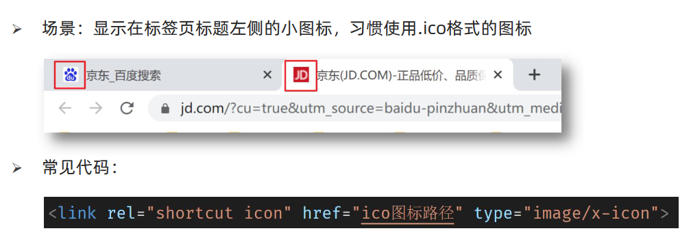
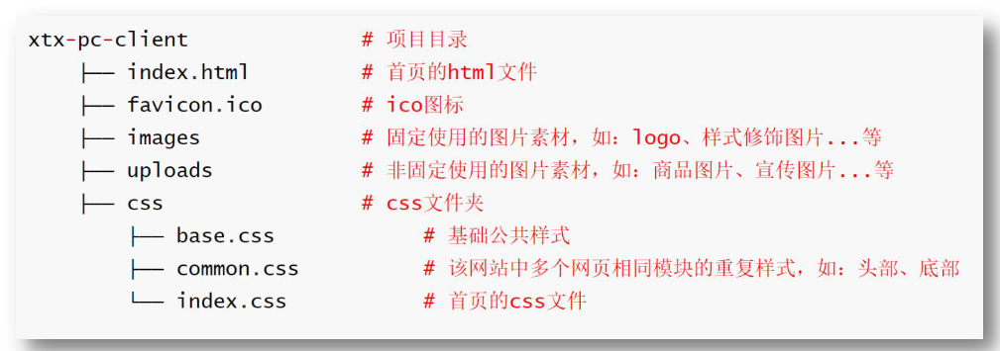
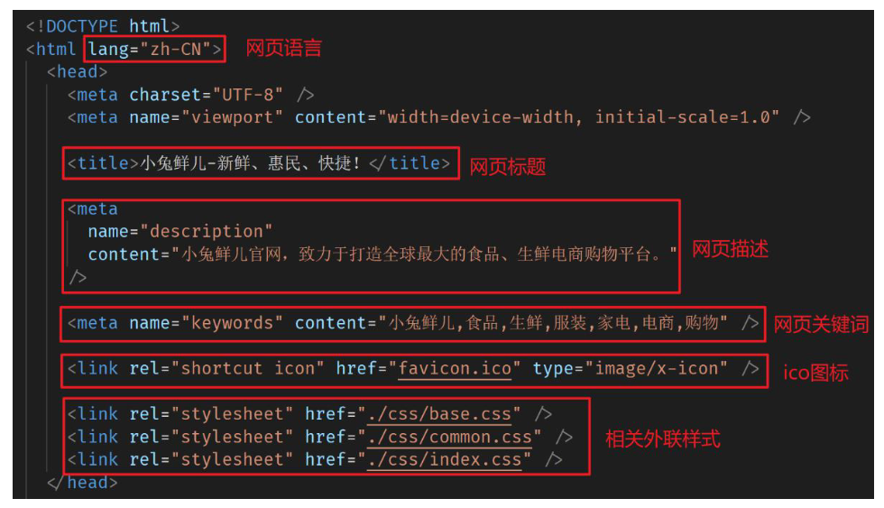

# 
14 项目知识

## 14.1 项目前置认知

### 14.1.1 SEO三大标签

- SEO简介
  - SEO（Search Engine Optimization）：搜索引擎优化
  - 作用：让网站在搜索引擎上的排名靠前
  - 提升SEO的常见方法：
    1. 竞价排名
    2. 将网页制作成html后缀
    3. 标签语义化（在合适的地方使用合适的标签）
    4. ......

- SEO三大标签
  1. title：网页标题标签
  2. description：网页描述标签
  3. keywords：网页关键词标签

~~~html
<!DOCTYPE html>
<html lang="en">
<head>
    <meta charset="UTF-8">
    <meta http-equiv="X-UA-Compatible" content="IE=edge">
    <meta name="viewport" content="width=device-width, initial-scale=1.0">

    <!-- meta:desc -->
    <meta name="description" content="京东JD.COM-专业的综合网上购物商城，为您提供正品低价的购物选择、优质便捷的服务体验。商品来自全球数十万品牌商家，囊括家电、手机、电脑、服装、居家、母婴、美妆、个护、食品、生鲜等丰富品类，满足各种购物需求。">

    <!-- meta:kw -->
    <meta name="keywords" content="网上购物,网上商城,家电,手机,电脑,服装,居家,母婴,美妆,个护,食品,生鲜,京东">

    <title>京东(JD.COM)-正品低价、品质保障、配送及时、轻松购物！</title>

    <!-- link:favicon : 浏览器标题栏图标 -->
    <link rel="shortcut icon" href="favicon.ico" type="image/x-icon">
</head>
<body>
</body>
</html>
~~~

### 14.1.2 ico图标设置

  

### 14.1.3 版心

- 场景：把页面的主体内容约束在网页中间
- 作用：让不同大小的屏幕都能看到页面的主体内容
- 代码：

    ~~~css
    /*版心*/
    .container {
        width: 1240px;
        margin: 0 auto;
    }
    ~~~

- 注意点：版心类名常用：container、wrapper、w 等

### 14.1.4 CSS书写顺序

- 衡量程序员的能力，除了要看实现业务需求的能力，还要看平时书写代码的规范（专业性）
- 不同的CSS书写顺序会影响浏览器的渲染性能，推荐前端工程师使用专业的书写顺序习惯

| 顺序 |     类别      |                            属性                             |
| :--: | :-----------: | :---------------------------------------------------------: |
|  1   |   布局属性    | display 、position 、 float 、  clear  visibility 、 overflow |
|  2   | 盒子模型+背景 |   width 、  height 、  margin   padding 、  border 、 background    |
|  3   | 文本内容属性  |    color 、 font 、text-decoration  text-align 、 line-height     |
|  4   |   点缀属性    |      cursor 、border-radius  text-shadow 、 box-shadow      |

- 注意点：开发中推荐多用类 + 后代，但不是层级越多越好，一个选择器中的类选择器的个数推荐 不要超过 3 个

## 14.2 项目结构搭建

### 14.2.1 文件和目录准备

- 新建项目文件夹 xtx-pc-client，在VScode中打开
    - 在实际开发中，项目文件夹不建议使用中文
    - 所有项目相关文件都保存在 xtx-pc-client 目录中

- 复制 favicon.ico 到 xtx-pc-client 目录
    - 一般习惯将ico图标放在项目根目录

- 复制 images 和 uploads 目录到 xtx-pc-client 目录中
    - images ：存放网站 固定使用 的图片素材，如：logo、样式修饰图片... 等
    - uploads：存放网站 非固定使用 的图片素材，如：商品图片、宣传图片...等

- 新建 index.html 在根目录

- 新建 css 文件夹保存网站的样式，并新建以下CSS文件：
    - base.css：基础公共样式
    - common.css：该网站中多个网页相同模块的重复样式，如：头部、底部
    - index.css：首页样式

  

### 14.2.2 基础公共样式

- 场景：一般项目开始前，首先会 去除掉浏览器默认样式，设置为 当前项目需要的初始化样式
- 作用：防止不同浏览器中标签默认样式不同的影响，统一不同浏览器的默认显示效果，方便后续项目开发
- 要求：已经准备好base.css代码，同学们需要认识，项目中可以直接引入使用

### 14.2.3 index页面骨架

  

~~~html
<!DOCTYPE html>
<html lang="en">
<head>
    <meta charset="UTF-8">
    <meta http-equiv="X-UA-Compatible" content="IE=edge">
    <meta name="viewport" content="width=device-width, initial-scale=1.0">
    <!-- meta:desc -->
    <meta name="description" content="小兔鲜儿官网，致力于打造全球最大的食品、生鲜电商购物平台">
    <!-- meta:kw -->
    <meta name="keywords" content="小兔鲜儿,食品,生鲜,服装,家电,电商,购物">
    <title>小兔鲜儿-新鲜、惠民、快捷！</title>
    <!-- link:favicon -->
    <link rel="shortcut icon" href="favicon.ico" type="image/x-icon">
    <!-- 按顺序引入: 外链式样式表后写的生效 -->
    <link rel="stylesheet" href="./css/base.css">
    <link rel="stylesheet" href="./css/common.css">
    <link rel="stylesheet" href="./css/index.css">
</head>
~~~