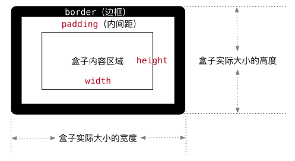

# 
9 CSS盒子模型

## 9.1 盒子模型的介绍

- 盒子的概念
   - 页面中的每一个标签，都可看做是一个 “盒子”，通过盒子的视角更方便的进行布局
   - 浏览器在渲染（显示）网页时，会将网页中的元素看做是一个个的矩形区域，我们也形象的称之为 盒子
- 盒子模型
    - CSS 中规定每个盒子分别由：内容区域（content）、内边距区域（padding）、边框区域（border）、外边距区域（margin）构成，这就是盒子模型

## 9.2 内容区域

- 作用：利用 width 和 height 属性默认设置是盒子内容区域的大小
- 属性：width / height
- 常见取值：数字+px

## 9.3 边框（ border ）

- 作用：给设置边框粗细、边框样式、边框颜色效果
- 单个属性：

|   作用   |    属性名    |               属性值               |
| :------: | :----------: | :--------------------------------: |
| 边框粗细 | border-width |              数字+px               |
| 边框样式 | border-style | 实线solid、虚线dashed 、点线dotted |
| 边框颜色 | border-color |              颜色取值              |

- 边框（border）- 连写形式
  - 属性名：border
  - 属性值：单个取值的连写，取值之间以空格隔开，如：`border : 10px solid red;`
  - 快捷键：bd + 回车

- 边框（border）- 单方向设置
  - 场景：只给盒子的某个方向单独设置边框
  - 属性名：border - 方位名词
  - 属性值：数字 + px

## 9.4 内边距（ padding ）

- 作用：设置 边框 与 内容区域 之间的距离
- 属性名：padding
- 常见取值：

|  取值  |           示例            |                          含义                          |
| :----: | :-----------------------: | :----------------------------------------------------: |
| 一个值 |       padding:10px;       |                  上右下左都设置为10px                  |
| 两个值 |     padding:10px 20px;     |             上下设置为10px、左右设置为20px             |
| 三个值 |   padding:10px 20px 30px;   |       上设置为10px、左右设置为20px、下设置为30px       |
| 四个值 | padding:10px 20px 30px 40px; | 上设置为10px、右设置为20px、下设置为30px、左设置为40px |

- 记忆规则：从上开始赋值，然后顺时针赋值，如果设置赋值的，看对面的！！
- 内边距（padding）- 单方向设置
    - 场景：只给盒子的某个方向单独设置内边距
    - 属性名：padding - 方位名词
    - 属性值：数字 + px

- 盒子实际大小计算
  - 盒子宽度 = 左边框 + 左padding + 内容宽度 + 右padding + 右边框
  - 盒子高度 = 上边框 + 上padding + 内容宽度 + 下padding + 下边框

  

- 给盒子设置border或padding时，盒子会被撑大，如果不想盒子被撑大？
  - 操作：给盒子设置属性`box-sizing : border-box ;`即可
  - 优点：浏览器会自动计算多余大小，自动在内容中减去

## 9.5 外边距（margin）

- 作用：设置边框以外，盒子与盒子之间的距离
- 属性名：margin
- 常见取值：

|  取值  |           示例            |                          含义                          |
| :----: | :-----------------------: | :----------------------------------------------------: |
| 一个值 |       margin:10px;       |                  上右下左都设置为10px                  |
| 两个值 |     margin:10px 20px;     |             上下设置为10px、左右设置为20px             |
| 三个值 |   margin:10px 20px 30px;   |       上设置为10px、左右设置为20px、下设置为30px       |
| 四个值 | margin:10px 20px 30px 40px; | 上设置为10px、右设置为20px、下设置为30px、左设置为40px |

- 记忆规则：从上开始赋值，然后顺时针赋值，如果设置赋值的，看对面的！！

- 外边距（margin） - 单方向设置
  - 场景：只给盒子的某个方向单独设置外边距
  - 属性名：margin - 方位名词
  - 属性值：数字 + px

|   方向   |     属性      |         效果         |
| :------: | :-----------: | :------------------: |
| 水平方向 |  margin-left  |  让当前盒子往右移动  |
| 水平方向 | margin-right  | 让右边的盒子往右移动 |
| 垂直方向 |  margin-top   |  往当前盒子往下移动  |
| 垂直方向 | margin-bottom | 让下面的盒子往下移动 |

- 外边距典型应用 - 块级盒子水平居中
  - 写法：`margin: 0 auto;`
  - 行内元素或者行内块元素水平居中给其父元素添加`text-align:center` 即可

- 清除默认内外边距
  - 场景：浏览器会默认给部分标签设置默认的margin和padding，但一般在项目开始前需要先清除这些标签默认的margin和padding，后续自己设置
  - 解决方法：

~~~css
*{
    margin: 0;
    padding: 0;
}
~~~

- 外边距折叠现象①  – 合并现象
  - 场景：垂直布局的块级元素，上下的margin会合并
  - 结果：最终两者距离为margin的最大值
  - 解决方法：只给其中一个盒子设置margin即可

- 外边距折叠现象②  – 塌陷现象
  - 场景：互相嵌套的块级元素，子元素的 margin-top 会作用在父元素上
  - 结果：导致父元素一起往下移动
  - 解决方法：
    1. 给父元素设置overflow：hidden
    2. 子元素转换成行内块元素
    3. 设置浮动

- 行内元素的margin和padding无效情况
  - 场景：给行内元素设置margin和padding时
  - 结果：
    - 水平方向的margin和padding布局中有效！
    - 垂直方向的margin和padding布局中无效！

