# 
12 CSS 装饰

## 12.1 垂直对齐方式

- 认识基线
  - 基线：浏览器文字类型元素排版中存在用于对齐的基线（baseline）

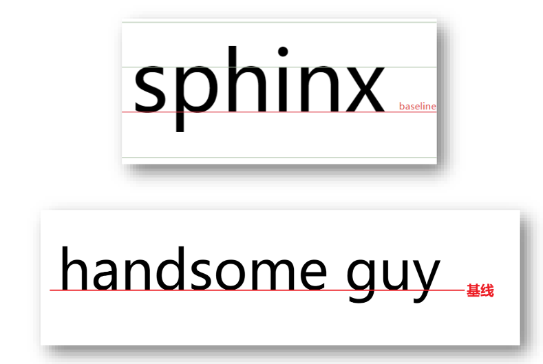  

- 文字对齐问题
  - 场景：解决行内/行内块元素垂直对齐问题
  - 问题：当图片和文字在一行中显示时，其实底部不是对齐的

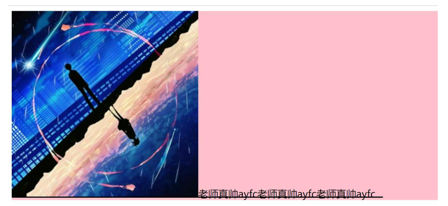  

- 垂直对齐方式
  - 属性名：vertical-align
  - 属性值：

|  属性值  |      效果      |
| :------: | :------------: |
| baseline | 默认，基线对齐 |
|   top    |    顶部对齐    |
|  middle  |    中部对齐    |
|  bottom  |    底部对齐    |

- 项目中 vertical-align 可以解决的问题

  - 文本框和表单按钮无法对齐问题

    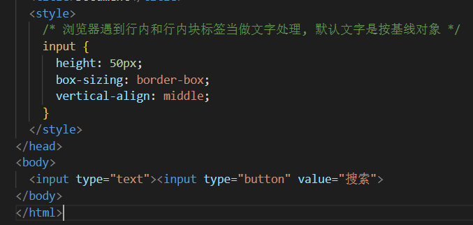  

  - input和img无法对齐问题

    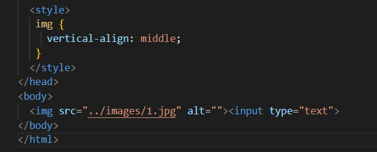  

  - div中的文本框，文本框无法贴顶问题

    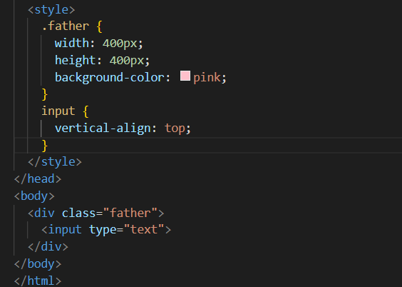  

  - div不设高度由img标签撑开，此时img标签下面会存在额外间隙问题

    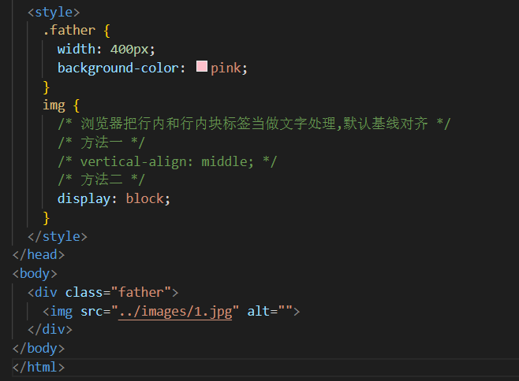  

  - 使用line-height让img标签垂直居中问题

    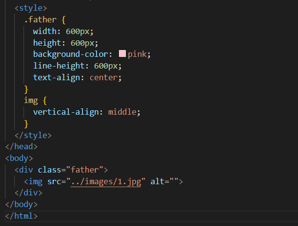  

- 注意点：
  - 学习浮动之后，不推荐使用行内块元素让div一行中显示，因为可能会出现垂直对齐问题
  - 推荐优先使用浮动完成效果

## 12.2 光标类型式

- 场景：设置鼠标光标在元素上时显示的样式
- 属性名：cursor
- 常见属性值：

| 属性值  |             效果             |
| :-----: | :--------------------------: |
| default |      默认值，通常是箭头      |
| pointer |  小手效果，提示用户可以点击  |
|  text   | 工字型，提示用户可以选择文字 |
|  move   |  十字光标，提示用户可以移动  |

## 12.3 边框圆角

- 场景：让盒子四个角变得圆润，增加页面细节，提升用户体验
- 属性名：border-radius
- 常见取值：数字+px 、百分比
- 原理：

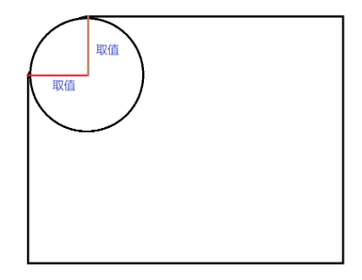  

- 赋值规则：从左上角开始赋值，然后顺时针赋值，没有赋值的看对角！
- 边框圆角的常见应用
  - 画一个正圆：
    - 盒子必须是正方形
    - 设置边框圆角为盒子宽高的一半 → border-radius:50%
  - 胶囊按钮：
    - 盒子要求是长方形
    - 设置 → border-radius：盒子高度的一半

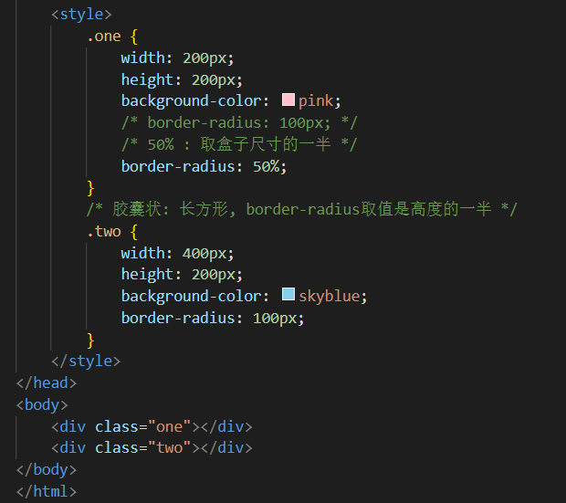  

## 12.4 溢出部分显示效果

- 溢出部分：指的是盒子 内容部分 所超出盒子范围的区域
- 场景：控制内容溢出部分的显示效果，如：显示、隐藏、滚动条......
- 属性名：overflow
- 常见属性值：

| 属性值  |                效果                |
| :-----: | :--------------------------------: |
| visible |        默认值，溢出部分可见        |
| hidden  |            溢出部分隐藏            |
| scroll  |     无论是否溢出，都显示滚动条     |
|  auto   | 根据是否溢出，自动显示或隐藏滚动条 |

## 12.5 元素本身隐藏

- 场景：让某元素本身在屏幕中不可见，鼠标悬停之后元素显示
- 常见属性：
  - visibility：hidden
  - display：none
- 区别：
  - visibility：hidden 隐藏元素本身，并且在网页中 占位置
  - display：none 隐藏元素本身，并且在网页中 不占位置
- 注意点：
  - 开发中经常会通过 display属性完成元素的显示隐藏切换
  - display：none；（隐藏）、 display：block；（显示）

## 12.6 元素整体透明度

- 场景：让某元素整体（包括内容）一起变透明
- 属性名：opacity
- 属性值：0~1之间的数字
    - 1：表示完全不透明
    - 0：表示完全透明
- 注意点：opacity会让元素整体透明，包括里面的内容，如：文字、子元素等.....

## 12.7 表格边框合并

- 场景：让相邻表格边框进行合并，得到细线边框效果
- 代码：border-collapse：collapse；（给table标签添加）

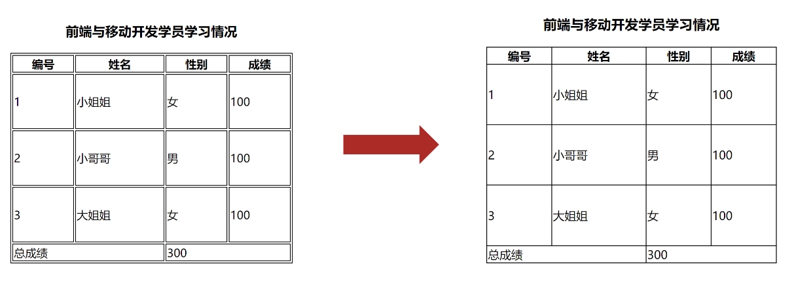  

~~~css
table {
    border: 1px solid #000;
    /* 注意: 一定要加给table标签 : 做细线表格 */
    border-collapse: collapse;
}

th,
td {
  border: 1px solid #000;
}
~~~

## 12.8 画三角形

- 场景：在网页中展示出小三角形时，除了可以使用图片外，还可以使用代码完成。
- 实现原理：利用盒子边框完成
- 实现步骤：
  1. 设置一个盒子
  2. 设置四周不同颜色的边框
  3. 将盒子宽高设置为0，仅保留边框
  4. 得到四个三角形，选择其中一个后，其他三角形（边框）设置颜色为透明

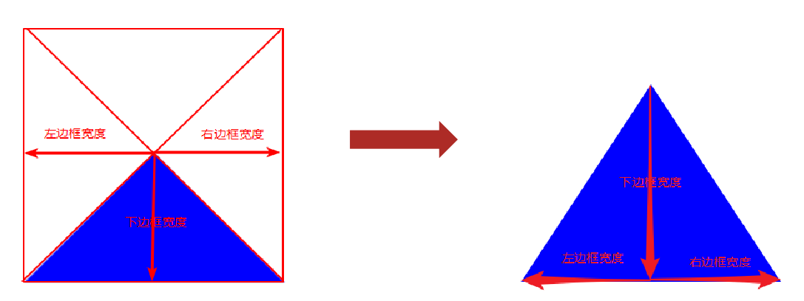  

~~~css
div {
  /* width: 100px; */
  /* height: 100px;  */
  width: 0;
  height: 0;
  /* background-color: pink; */
  /* transparent: 透明 */
  border-top: 10px solid transparent;
  border-right: 10px solid transparent;
  border-bottom: 10px solid transparent;
  border-left: 10px solid orange;
}
~~~

