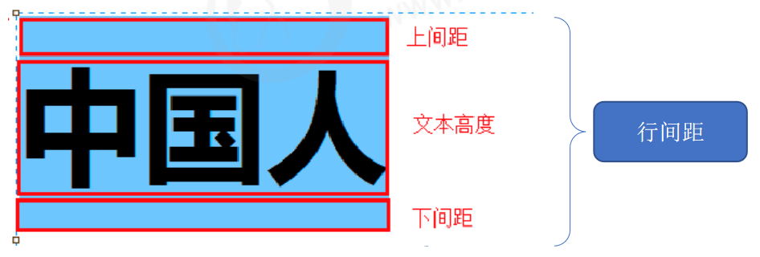
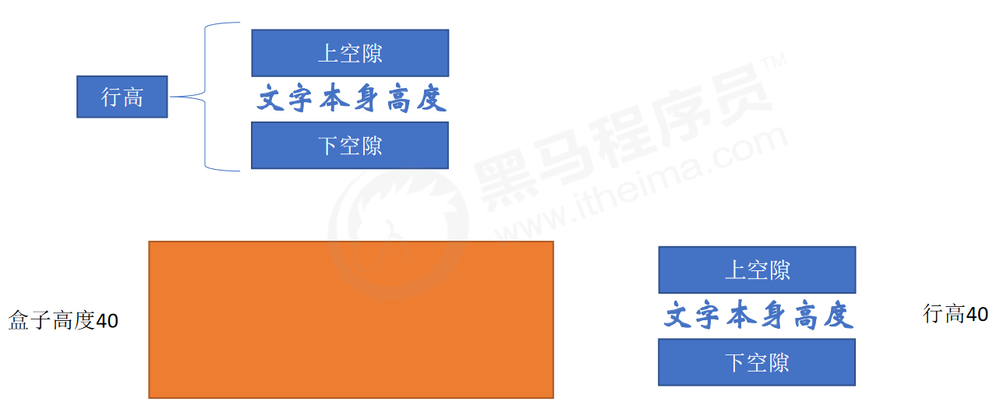

# 
4 CSS文本属性

## 4.1 文本颜色：color

- 属性名：color
- 属性值：

|  颜色表示方式  |                表示含义                 |                     属性值                     |
| :------------: | :-------------------------------------: | :--------------------------------------------: |
|     关键词     |             预定义的颜色名              |         red、green、blue、yellow.....          |
|   rgb表示法    |    红绿蓝三原色，每项取值范围:0~255     | rgb(0,0,0)、rgb(255,255,255)、rgb(255,0,0..... |
|   rgba表示法   | 红绿蓝三原色+a表示透明度，取值范围是0~1 |  rgba(255,255,255,0.5)、rgba(255,0,0,0.3)...   |
| 十六进制表示法 |     #开头,将数字转换成十六进制表示      |   #000000、#ff0000、#e92322，简写:#000、#f00   |

## 4.2 文本缩进：text-indent

- 属性名：text-indent
- 取值：
    - 数字+px
    - 数字+em（推荐：1em = 当前标签的font-size的大小）

## 4.3 文本对齐：text-align

- 属性名：text-align
- 取值：

| 属性值 |   效果   |
| :----: | :------: |
|  left  |  左对齐  |
| center | 居中对齐 |
| right  |  右对齐  |

- text-align : center 能让哪些元素水平居中？
  - 文本
  - span标签、a标签
  - input标签、img标签

## 4.4 文本修饰：text-decoration

- 属性名：text-decoration
- 取值：

|    属性值    |       效果        |
| :----------: | :---------------: |
|  underline   |   下划线（常用)   |
| line-through |  删除线(不常用)   |
|   overline   | 上划线（几乎不用) |
|     none     |  无装饰线（常用)  |

- 注意点：开发中会使用`text-decoration : none;`清除a标签默认的下划线

## 4.5 行高：line-height

- 作用：控制一行的上下行间距

  

- 属性名：line-height
- 取值：
    - 数字+px
    - 倍数（当前标签font-size的倍数）
- 应用：
  - 让单行文本垂直居中可以设置 `line-height : 文字父元素高度`
  - 网页精准布局时，会设置 `line-height : 1` 可以取消上下间距
- 行高与font连写的注意点：
    - 如果同时设置了行高和font连写，注意覆盖问题
    - font : style weight **size/line-height** family ;

  

- 单行文字垂直居中

- 单行文字垂直居中的原理
  - 简单理解: 行高的上空隙和下空隙把文字挤到中间了，如果行高小于盒子高度，文字会偏上；如果行高大于盒子高度，则文字偏下

  

