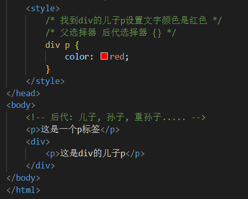
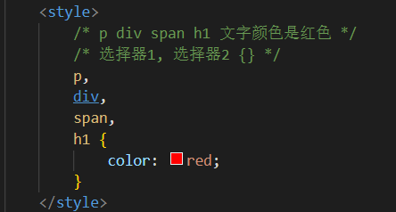
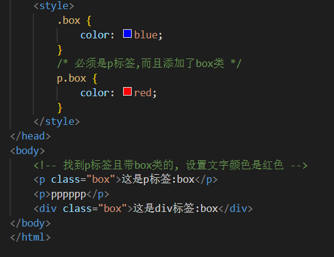
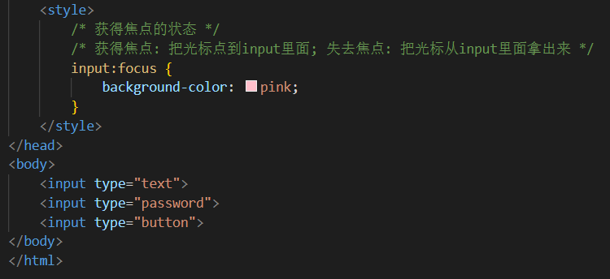

# 
5 CSS 复合选择器

&emsp;&emsp;复合选择器可以更准确、更高效的选择目标元素（标签），复合选择器是由两个或多个基础选择器，通过不同的方式组合而成的，常用的复合选择器包括：后代选择器、子选择器、并集选择器、伪类选择器等等

## 5.1 后代选择器

- 作用：根据 HTML 标签的嵌套关系，选择父元素后代中满足条件的元素
- 选择器语法：选择器1 选择器2 { css }
- 结果：在选择器1中找到为选择器2的后代标签，设置样式
- 注意点：
  - 后代包括：儿子、孙子、重孙子......
  - 后代选择器中，选择器与选择器之前通过空格隔开

  

## 5.2 子代选择器

- 作用：根据 HTML 标签的嵌套关系，选择父元素子代中满足条件的元素
- 选择器语法：选择器1 > 选择器2 { css }
- 结果：在选择器1中找到为选择器2的子代标签，设置样式
- 注意点：
  - 子代只包括：儿子
  - 子代选择器中，选择器与选择器之前通过 > 隔开

  

## 5.3 并集选择器

- 作用：同时选择多组标签，设置相同的样式
- 选择器语法：选择器1，选择器2 { css }
- 结果：找到选择器1和选择器2选中的标签，设置样式
- 注意点：
  - 并集选择器中的每组选择器之间通过 , 分隔
  - 并集选择器中的每组选择器可以是基础选择器或者复合选择器
  - 并集选择器中的每组选择器通常一行写一个，提高代码的可读性

  

## 5.4 交集选择器

- 作用：选中页面中同时满足多个选择器的标签
- 选择器语法：选择器1选择器2 { css }
- 结果：（既又原则）找到页面中既能被选择器1选中，又能被选择器2选中的标签，设置样式
- 注意点：
  - 交集选择器中的选择器之间是紧挨着的，没有东西分隔
  - 交集选择器中如果有标签选择器，标签选择器必须写在最前面

  

## 5.5 属性选择器

- 场景：通过元素上的HTML属性来选择元素，常用于选择 input 标签
- 选择器语法：

|    语法     |                   功能                   |
| :-----------: | :--------------------------------------: |
|    E[attr]{ }   |         选择具有attr属性的E元素          |
| E[attr="val"]{ } | 选择具有attr属性并且属性值等于val的E元素 |

  

## 5.6 伪类选择器

- 伪类选择器用于向某些选择器添加特殊的效果，比如给链接添加特殊效果，或选择第1个，第n个元素
- 伪类选择器书写最大的特点是用冒号（:）表示，比如 :hover 、 :first-child 

### 5.6.1 hover伪类选择器

- 作用：选中鼠标悬停在元素上的状态，设置样式
- 选择器语法：选择器:hover { css }

    ~~~css
    /* 悬停的时候文字颜色是红色 */
    a:hover {
        color: red;
        background-color: green;
    }

    /* 用户鼠标悬停到div的时候, 文字是绿色 */
    div:hover {
        color: green;
    }
    ~~~

### 5.6.2 结构伪类选择器

- 作用与优势：
  - 作用：根据元素在HTML中的结构关系查找元素
  - 优势：减少对于HTML中类的依赖，有利于保持代码整洁
  - 场景：常用于查找某父级选择器中的子元素
- 选择器

|        选择器         |                    说明                    |
| :-------------------: | :----------------------------------------: |
|     E:first-child{}     |   匹配父元素中第一个子元素，并且是E元素  |
|     E:last-child{}      |  匹配父元素中最后一个子元素，并且是E元素 |
|   E:nth-child(n){}    |    匹配父元素中第n个子元素，并且是E元素    |
| E:nth-last-child(n){} |  匹配父元素中倒数第n个子元素，并且是E元素  |

- n的注意点：
  - n为：0、1、2、3、4、5、6、......
  - 通过n可以组成常见公式

|      功能       |      公式       |
| :-------------: | :-------------: |
|      偶数       |    2n、even     |
|      奇数       | 2n+1、2n-1、odd |
|    找到前5个    |      -n+5       |
| 找到从第5个往后 |       n+5       |

  

### 5.6.2 链接伪类选择器

- 场景：常用于选中超链接的不同状态
- 选择器语法：

| 选择器语法 |            功能             |
| :--------: | :-------------------------: |
|   a:link{ }   |  a链接未访问过的状态 |
| a:visited{ }  |  a链接访问之后的状态 |
|  a:hover{ }   |   鼠标悬停的状态    |
|  a:active{ }  |    鼠标按下的状态    |

- 注意点：
  - 如果需要同时实现以上四种伪类状态效果，需要按照 LVHA 顺序书写
  - 其中 :hover伪类选择器 使用更为频繁，常用于选择各类元素的悬停状态

### 5.6.3 焦点伪类选择器

- 场景：用于选中元素获取焦点时状态，常用于表单控件
- 选择器语法：input:focus{ }
- 效果：表单控件获取焦点时默认会显示外部轮廓线

  
