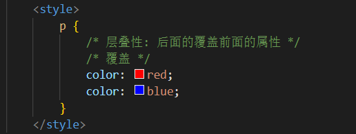

# 
8 CSS三大特性

## 8.1 层叠性

- 问题：给同一个标签设置了相同的样式，此时浏览器会如何渲染呢？

      

- 结果：如果给同一个标签设置了相同的属性，此时样式会层叠（覆盖），写在最下面的会生效
- TIP：
    - CSS （Cascading style sheets） 层叠样式表
    - 所谓的层叠即叠加的意思，表示样式可以一层一层的层叠覆盖
    - 当样式冲突时，只有当选择器优先级相同时，才能通过层叠性判断结果

## 8.2 继承性

- 特性：子元素有默认继承父元素样式的特点（子承父业）
- 可以继承的常见属性(文字控制属性都可以继承)
  1. color
  2. font-style、font-weight、font-size、font-family
  3. text-indent、text-align
  4. line-height
  5. ......
- 注意点：可以通过调试工具判断样式是否可以继承

      

- 继承的应用
  - 好处：可以在一定程度上减少代码
  - 常见应用场景：
    - 可以直接给ul设置 list-style:none 属性，从而去除列表默认的小圆点样式
    - 直接给body标签设置统一的font-size，从而统一不同浏览器默认文字大小

- 继承失效的特殊情况
  - 如果元素有浏览器默认样式，此时继承性依然存在，但是优先显示浏览器的默认样式
  - a标签的color会继承失效，其实color属性继承下来了，但是被浏览器默认设置的样式给覆盖掉了
  - h系列标签的font-size会继承失效，其实font-size属性继承下来了，但是被浏览器默认设置的样式给覆盖掉了

## 8.3 优先级

- 特性：不同选择器具有不同的优先级，优先级高的选择器样式会覆盖优先级低选择器样式
- 优先级公式：继承 < 通配符选择器 < 标签选择器 < 类选择器 < id选择器 < 行内样式 < !important
- 注意点：
  - !important写在属性值的后面，分号的前面
  - !important不能提升继承的优先级，只要是继承优先级最低
  - 实际开发中不建议使用 !important

- 权重叠加计算
  - 场景：如果是复合选择器，此时需要通过权重叠加计算方法，判断最终哪个选择器优先级最高会生效
  - 权重叠加计算公式：（每一级之间不存在进位）

    

- 比较规则：
  1. 先比较第一级数字，如果比较出来了，之后的统统不看
  2. 如果第一级数字相同，此时再去比较第二级数字，如果比较出来了，之后的统统不看
  3. ......
  4. 如果最终所有数字都相同，表示优先级相同，则比较层叠性（谁写在下面，谁说了算!）

- 注意点：!important如果不是继承，则权重最高，天下第一

~~~html
<!DOCTYPE html>
<html>
<head>
    <meta charset="utf-8">
    <title>第1题：普通题</title>
    
</head>
<body>
    

        

            <!-- 蓝色 -->
            这行文本是什么颜色的？ 
        

    

</body>
</html>
~~~

