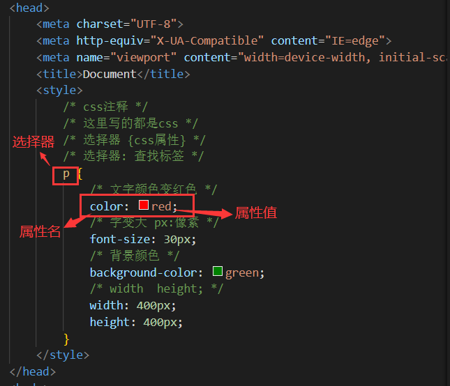

# CSS基础

## 基础认知

目标：理解 CSS 的作用，了解 CSS 语法规则，知道 CSS 的引入方式及其区别

### CSS初识

- CSS：层叠样式表（Cascading style sheets）
- CSS作用是什么？
  - 给页面中的HTML标签设置样式
- CSS写在哪里？
  - css写在style标签中，style标签一般写在head标签里面，title标签下面（这是CSS的其中一种写法，后续还会讲其他写法）

      

- 常见属性：

    |   css常见属性    |   作用   |
    | :--------------: | :------: |
    |      color       | 文字颜色 |
    |    font-size     | 字体大小 |
    | background-color | 背景颜色 |
    |      width       |   宽度   |
    |      height      |   高度   |

- 注意点：
  1. CSS 标点符号都是英文状态下的
  2. 每一个样式键值对写完之后，最后需要写分号

### CSS引入方式

- 内嵌式：CSS 写在style标签中
    - 提示：style标签虽然可以写在页面任意位置，但是通常约定写在 head 标签中
- 外联式：CSS 写在一个单独的.css文件中
    - 提示：需要通过link标签在网页中引入
- 行内式：CSS 写在标签的style属性中
    - 提示：基础班不推荐使用，之后会配合js使用

      

- CSS常见三种引入方式的特点区别有哪些（书写位置、作用范围、使用场景） ？

    | 引入方式 |                 书写位置                 | 作用范围 |  使用场景  |
    | :------: | :--------------------------------------: | :------: | :--------: |
    |  内嵌式  |            CSS写在style标签中            | 当前页面 |   小案例   |
    |  外联式  | CSS写在单独的css文件中，通过link标签引入 | 多个页面 |   项目中   |
    |  行内式  |         CSS写在标签的style属性中         | 当前标签 | 配合js使用 |

## 基础选择器

目标：理解选择器的作用，能够使用基础选择器在 HTML 中选择元素

### 选择器的作用
- 选择页面中对应的标签（找她），方便后续设置样式（改她）

### 标签选择器
- 结构：标签名 { css属性名：属性值； }

      

- 作用：通过标签名，找到页面中所有这类标签，设置样式
- 注意点：
  1. 标签选择器选择的是一类标签，而不是单独某一个
  2. 标签选择器无论嵌套关系有多深，都能找到对应的标签

### 类选择器

- 结构：.类名 { css属性名：属性值； }

      

- 作用：通过类名，找到页面中所有带有这个类名的标签，设置样式
- 注意点：
  1. 所有标签上都有class属性，class属性的属性值称为类名（类似于名字）
  2. 类名可以由数字、字母、下划线、中划线组成，但不能以数字或者中划线开头
  3. 一个标签可以同时有多个类名，类名之间以空格隔开
  4. 类名可以被重复使用，一个类选择器可以同时选中多个标签

### id选择器

- 结构：#id属性值 { css属性名：属性值； }

      

- 作用：通过id属性值，找到页面中带有这个id属性值的标签，设置样式
- 注意点：
  1. 所有标签上都有id属性
  2. id属性值类似于身份证号码，在一个页面中是唯一的，不可重复的！
  3. 一个标签上只能有一个id属性值
  4. 一个id选择器只能选中一个标签

- **补充：类与id的区别**

  - class类名与id属性值的区别
      - class类名相当于姓名，可以重复，一个标签可以同时有多个class类名
      - id属性值相当于身份证号码，不可重复，一个标签只能有一个id属性值
  - 类选择器与id选择器的区别
      - 类选择器以 . 开头
      - id选择器以 # 开头
  - 实际开发的情况
      - 类选择器用的最多
      - id一般配合js使用，除非特殊情况，否则不要使用id设置样式
      - 实际开发中会遇到冗余代码的抽取 （可以将一些公共的代码抽取到一个公共的类中去）

### 通配符选择器

- 结构：* { css属性名：属性值； }

      

- 作用：找到页面中所有的标签，设置样式
- 注意点：
  1. 开发中使用极少，只会在极特殊情况下才会用到
  2. 在基础班小页面中可能会用于去除标签默认的margin和padding（后续讲解）

          

## 字体和文本样式

目标：能够使用 字体和文本相关样式 修改元素外观样式

### 字体样式

#### 字体大小：font-size

1. 属性名：font-size
1. 取值：数字 + px
1. 注意点：
    - 谷歌浏览器默认文字大小是16px
    - 单位需要设置，否则无效

#### 字体粗细：font-weight

- 属性名：font-weight
- 取值：
    - 关键字：

        | 正常  | normal |
        | :---: | :----: |
        | 加粗  |  bold  |

    - 纯数字：100~900的整百数：

        | 正常  |  400  |
        | :---: | :---: |
        | 加粗  |  700  |

- 注意点：
    - 不是所有字体都提供了九种粗细，因此部分取值页面中无变化
    - 实际开发中以：正常、加粗两种取值使用最多

#### 字体样式：font-style

- 属性名：font-style
- 取值：
    - 正常（默认值）：normal
    - 倾斜：italic

#### 字体类型：font-family

- 属性名：font-family
- 常见取值：具体字体1,具体字体2,具体字体3,具体字体4,...,字体系列
    - 具体字体："Microsoft YaHei"、微软雅黑、黑体、宋体、楷体等......
    - 字体系列：sans-serif、serif、monospace等......
- 渲染规则：
  1. 从左往右按照顺序查找，如果电脑中未安装该字体，则显示下一个字体
  2. 如果都不支持，此时会根据操作系统，显示最后字体系列的默认字体
- 注意点：
   1. 如果字体名称中存在多个单词，推荐使用引号包裹
   2. 最后一项字体系列不需要引号包裹
   3. 网页开发时，尽量使用系统常见自带字体，保证不同用户浏览网页都可以正确显示

      

- **常见字体系列**

  - 无衬线字体（sans-serif）
    - 特点：文字笔画粗细均匀，并且首尾无装饰
    - 场景：网页中大多采用无衬线字体
    - 常见该系列字体：黑体、Arial
  - 衬线字体（serif）
     - 特点：文字笔画粗细不均，并且首尾有笔锋装饰
     - 场景：报刊书籍中应用广泛
     - 常见该系列字体：宋体、Times New Roman
  - 等宽字体（monospace）
     - 特点：每个字母或文字的宽度相等
     - 场景：一般用于程序代码编写，有利于代码的阅读和编写
     - 常见该系列字体：Consolas、fira code

#### font属性连写

- 属性名：font (复合属性)
- 取值：
    - font : style weight size family;
- 省略要求：
    - 只能省略前两个，如果省略了相当于设置了默认值
- 注意点：如果需要同时设置单独和连写形式
    - 要么把单独的样式写在连写的下面
    - 要么把单独的样式写在连写的里面

  

### 文本样式

#### 文本缩进：text-indent

- 属性名：text-indent
- 取值：
    - 数字+px
    - 数字+em（推荐：1em = 当前标签的font-size的大小）

#### 水平对齐方式：text-align

- 属性名：text-align
- 取值：

    | 属性值 |   效果   |
    | :----: | :------: |
    |  left  |  左对齐  |
    | center | 居中对齐 |
    | right  |  右对齐  |

- 注意点：
    - 如果需要让文本水平居中，text-align属性给文本所在标签（文本的父元素）设置

          

- text-align : center 能让哪些元素水平居中？
  - 文本
  - span标签、a标签
  - input标签、img标签

#### 文本修饰：text-decoration

- 属性名：text-decoration
- 取值：

    |    属性值    |       效果        |
    | :----------: | :---------------: |
    |  underline   |   下划线（常用)   |
    | line-through |  删除线(不常用)   |
    |   overline   | 上划线（几乎不用) |
    |     none     |  无装饰线（常用)  |

- 注意点：
   - 开发中会使用 text-decoration : none ; 清除a标签默认的下划线

#### 行高：line-height

- 作用：控制一行的上下行间距
- 属性名：line-height
- 取值：
    - 数字+px
    - 倍数（当前标签font-size的倍数）
- 应用：
  - 让单行文本垂直居中可以设置 line-height : 文字父元素高度
  - 网页精准布局时，会设置 line-height : 1 可以取消上下间距
- 行高与font连写的注意点：
    - 如果同时设置了行高和font连写，注意覆盖问题
    - font : style weight **size/line-height** family ;

      

- **设置内容垂直居中**

      

### 拓展：样式的层叠问题

- 问题：
    - 给同一个标签设置了相同的样式，此时浏览器会如何渲染呢？

          

- 结果：
    - 如果给同一个标签设置了相同的属性，此时样式会层叠（覆盖），写在最下面的会生效
- TIP：
    - CSS （Cascading style sheets） 层叠样式表
    - 所谓的层叠即叠加的意思，表示样式可以一层一层的层叠覆盖

### 拓展：颜色常见取值

- 属性名：
    - 如：文字颜色：color
    - 如：背景颜色：background-color
- 属性值：

    |  颜色表示方式  |                表示含义                 |                     属性值                     |
    | :------------: | :-------------------------------------: | :--------------------------------------------: |
    |     关键词     |             预定义的颜色名              |         red、green、blue、yellow.....          |
    |   rgb表示法    |    红绿蓝三原色，每项取值范围:0~255     | rgb(0,0,0)、rgb(255,255,255)、rgb(255,0,0..... |
    |   rgba表示法   | 红绿蓝三原色+a表示透明度，取值范围是0~1 |  rgba(255,255,255,0.5)、rgba(255,0,0,0.3)...   |
    | 十六进制表示法 |     #开头,将数字转换成十六进制表示      |   #000000、#ff0000、#e92322，简写:#000、#f00   |

- **取值类型①：关键词**

    - 常见颜色取值：
        - red：红色
        - green：绿色
        - blue：蓝色
        - yellow：黄色
        - orange：橘色
        - skyblue：天蓝色
        - pink：粉色

- **取值类型②：rgb表示法**

    - 每项取值范围：0~255
    - 常见颜色取值：
        - rgb ( 255 , 0 , 0 ) ：红色
        - rgb ( 0 , 255 , 0 ) ：绿色
        - rgb ( 0 , 0 , 255 ) ：蓝色
        - rgb ( 0 , 0 , 0 ) ：黑色
        - rgb ( 255 , 255 , 255 ) ：白色

- **取值类型③：rgba表示法**
    - 比rgb表示法多个一个a，a表示透明度

    - a的取值范围：0~1
        - 1：完全不透明
        - 0：完全透明
    - 省略写法：
        - rgba ( 0 , 0 , 0 , 0.5 ) 可以省略写成 rgba ( 0 , 0 , 0 , .5)

- **取值类型④：十六进制表示法**

    - 取值范围：
        - 两个数字为一组，每个数字的取值范围：0~9 , a , b , c , d , e , f
    - 省略写法：
        - 如果三组中，每组数字都相同，此时可以每组可以省略只写一个数字
        - 正确写法：#ffaabb 改写成 #fab
    - 常见取值：
        - #fff ：白色
        - #000 ：黑色
    - 注意点
      1. 类似于：#ffaabc 不能改写成 #fabc
      2. 实际开发中会直接使用测量工具直接得到颜色，不需要前端自己设计颜色，直接复制粘贴即可

### 拓展：标签水平居中

- 如果需要让div、p、h（大盒子）水平居中？
    - 可以通过margin : 0 auto ; 实现
- 注意点：
  - 如果需要让 div、p、h（大盒子） 水平居中，直接给 当前元素本身 设置即可
  - margin：0 auto 一般针对于固定宽度的盒子，如果大盒子没有设置宽度，此时会默认占满父元素的宽度

 

## Chrome调试工具

目标：能够认识 Chrome调试工具 的基础操作，能够使用 Chrome 调试工具 修改和调试样式

  

  

① Ctrl+滚轮 可以放大开发者工具代码大小。
② 左边是 HTML 元素结构，右边是 CSS 样式。
③ 右边 CSS 样式可以改动数值（左右箭头或者直接输入）和查看颜色。
④ Ctrl + 0 复原浏览器大小。
⑤ 如果点击元素，发现右侧没有样式引入，极有可能是类名或者样式引入错误。
⑥ 如果有样式，但是样式前面有黄色叹号提示，则是样式属性书写错误。

## 选择器进阶

目标：能够理解 复合选择器 的规则，并使用 复合选择器 在 HTML 中选择元素

### 复合选择器

#### 后代选择器

- 作用：根据 HTML 标签的嵌套关系，选择父元素 后代中 满足条件的元素
- 选择器语法：选择器1 选择器2 { css }
- 结果：
    - 在选择器1所找到标签的后代（儿子、孙子、重孙子...）中，找到满足选择器2的标签，设置样式
- 注意点：
  1. 后代包括：儿子、孙子、重孙子......
  2. 后代选择器中，选择器与选择器之前通过 空格 隔开

#### 子代选择器

- 作用：根据 HTML 标签的嵌套关系，选择父元素 子代中 满足条件的元素
- 选择器语法：选择器1 > 选择器2 { css }
- 结果：
    - 在选择器1所找到标签的子代（儿子）中，找到满足选择器2的标签，设置样式
- 注意点：
  1. 子代只包括：儿子
  2. 子代选择器中，选择器与选择器之前通过 > 隔开

### 并集选择器

- 作用：同时选择多组标签，设置相同的样式
- 选择器语法：选择器1 ， 选择器2 { css }
- 结果：
    - 找到 选择器1 和 选择器2 选中的标签，设置样式
- 注意点：
  1. 并集选择器中的每组选择器之间通过 , 分隔
  2. 并集选择器中的每组选择器可以是基础选择器或者复合选择器
  3. 并集选择器中的每组选择器通常一行写一个，提高代码的可读性

### 交集选择器

- 作用：选中页面中 同时满足 多个选择器的标签
- 选择器语法：选择器1选择器2 { css }
- 结果：
    - （既又原则）找到页面中 既 能被选择器1选中，又 能被选择器2选中的标签，设置样式
- 注意点：
  1. 交集选择器中的选择器之间是紧挨着的，没有东西分隔
  2. 交集选择器中如果有标签选择器，标签选择器必须写在最前面

### hover伪类选择器

- 作用：选中鼠标悬停在元素上的状态，设置样式
- 选择器语法：选择器:hover { css }
- 注意点：
  - 伪类选择器选中的元素的某种状态

### Emmet语法

- 作用：通过简写语法，快速生成代码
- 语法：

|        示例         |                  效果                  |
| :-----------------: | :------------------------------------: |
|         div         |             `

`              |
|        .red         |       `

`        |
|        #one         |        `

`         |
|      p.red#one      |     `

`     |
|        ul>li        |          `<ul><li></li></u1>`          |
| ul>li{我是li的内容} |    `<u1><li>我是1i的内容</li></u1>`    |
|       ul>li*3       | `<ul><li></li><li></li><li></li></u1>` |

## 背景相关属性

目标：能够使用 背景相关属性 装饰元素的背景样式

### 背景颜色

- 属性名：background-color（bgc）
- 属性值：
    - 颜色取值：关键字、rgb表示法、rgba表示法、十六进制......
- 注意点：
    - 背景颜色默认值是透明： rgba(0,0,0,0) 、transparent
    - 背景颜色不会影响盒子大小，并且还能看清盒子的大小和位置，一般在布局中会习惯先给盒子设置背景颜色

### 背景图片

- 属性名：background-image（bgi）
- 属性值：`background-image: url(图片的路径);`
- 注意点：
    - 背景图片中url中可以省略引号
    - 背景图片默认是在水平和垂直方向平铺的
    - 背景图片仅仅是指给盒子起到装饰效果，类似于背景颜色，是不能撑开盒子的

### 背景平铺

- 属性名：background-repeat（bgr）
- 属性值：

    |   取值    |             效果             |
    | :-------: | :--------------------------: |
    |  repeat   | (默认值)水平和垂直方向都平铺 |
    | no-repeat |            不平铺            |
    | repeat-x  |    沿着水平方向(x轴)平铺     |
    | repeat-y  |    沿着垂直方向(y轴）平铺    |

### 背景位置

- 属性名：background-position（bgp）
- 属性值：

      

- 注意点：
    - 方位名词取值和坐标取值可以混使用，第一个取值表示水平，第二个取值表示垂直

### 背景相关属性连写

- 属性名：background（bg）
- 属性值：
    - 单个属性值的合写，取值之间以空格隔开
- 书写顺序：
    - 推荐：background：color image repeat position
- 省略问题：
    - 可以按照需求省略
    - 特殊情况：在pc端，如果盒子大小和背景图片大小一样，此时可以直接写 background：url()
- 注意点
    - 如果需要设置单独的样式和连写
     ① 要么把单独的样式写在连写的下面
     ② 要么把单独的样式写在连写的里面

### 拓展：img标签和背景图片的区别

- 需求：需要在网页中展示一张图片的效果？
- 方法一：直接写上img标签即可
    - img标签是一个标签，不设置宽高默认会以原尺寸显示
- 方法二：div标签 + 背景图片
    - 需要设置div的宽高，因为背景图片只是装饰的CSS样式，不能撑开div标签

## 元素显示模式

目标：能够认识三种常见的 元素显示模式，并通过代码实现不同 元素显示模式 的转换

### 块级元素

- 显示特点：
  - 独占一行（一行只能显示一个）
  - 宽度默认是父元素的宽度，高度默认由内容撑开
  - 可以设置宽高
- 代表标签：
    - div、p、h系列、ul、li、dl、dt、dd、form、header、nav、footer.....

### 行内元素

- 显示特点：
  - 一行可以显示多个
  - 宽度和高度默认由内容撑开
  - 不可以设置宽高
- 代表标签：
    - a、span 、b、u、i、s、strong、ins、em、del......

### 行内块元素

- 显示特点：
  - 一行可以显示多个
  - 可以设置宽高
- 代表标签：
    - input、textarea、button、select......
    - 特殊情况：img标签有行内块元素特点，但是Chrome调试工具中显示结果是inline

### 元素显示模式转换

- 目的：改变元素默认的显示特点，让元素符合布局要求
- 语法：

    |         属性         |       效果       | 使用频率 |
    | :------------------: | :--------------: | :------: |
    |    display:block     |  转换成块级元素  |   较多   |
    | display:inline-block | 转换成行内块元素 |   较多   |
    |    display:inline    |  转换成行内元素  |   极少   |

### 拓展：HTML嵌套规范注意点

- 块级元素一般作为大容器，可以嵌套：文本、块级元素、行内元素、行内块元素等等......
    - 但是：p标签中不要嵌套div、p、h等块级元素
- a标签内部可以嵌套任意元素
    - 但是：a标签不能嵌套a标签

### 居中方法总结

  

## CSS 特性

目标：能够认识 CSS 的 继承 和 层叠 特性

### 继承性

- 特性：子元素有默认继承父元素样式的特点（子承父业）
- 可以继承的常见属性(文字控制属性都可以继承)
  1. color
  2. font-style、font-weight、font-size、font-family
  3. text-indent、text-align
  4. line-height
  5. ......
- 注意点：
    - 可以通过调试工具判断样式是否可以继承

      

- **继承的应用**

  - 好处：可以在一定程度上减少代码
  - 常见应用场景：
    1. 可以直接给ul设置 list-style:none 属性，从而去除列表默认的小圆点样式
    2. 直接给body标签设置统一的font-size，从而统一不同浏览器默认文字大小

- **继承失效的特殊情况**

  - 如果元素有浏览器默认样式，此时继承性依然存在，但是优先显示浏览器的默认样式
  - a标签的color会继承失效
      - 其实color属性继承下来了，但是被浏览器默认设置的样式给覆盖掉了
  - h系列标签的font-size会继承失效
      - 其实font-size属性继承下来了，但是被浏览器默认设置的样式给覆盖掉了

### 层叠性

- 特性：
  - 给同一个标签设置不同的样式 → 此时样式会层叠叠加 → 会共同作用在标签上
   - 给同一个标签设置相同的样式 → 此时样式会层叠覆盖 → 最终写在最后的样式会生效
- 注意点：
   - 当样式冲突时，只有当选择器优先级相同时，才能通过层叠性判断结果

### 优先级

- **优先级的介绍**

  - 特性：不同选择器具有不同的优先级，优先级高的选择器样式会覆盖优先级低选择器样式
  - 优先级公式：
      - 继承 < 通配符选择器 < 标签选择器 < 类选择器 < id选择器 < 行内样式 < !important
  - 注意点：
    1. !important写在属性值的后面，分号的前面
    2. !important不能提升继承的优先级，只要是继承优先级最低
    3. 实际开发中不建议使用 !important

- **权重叠加计算**

  - 场景：如果是复合选择器，此时需要通过权重叠加计算方法，判断最终哪个选择器优先级最高会生效
  - 权重叠加计算公式：（每一级之间不存在进位）

      

  - 比较规则：
    1. 先比较第一级数字，如果比较出来了，之后的统统不看
    2. 如果第一级数字相同，此时再去比较第二级数字，如果比较出来了，之后的统统不看
    3. ......
    4. 如果最终所有数字都相同，表示优先级相同，则比较层叠性（谁写在下面，谁说了算!）
  - 注意点：!important如果不是继承，则权重最高，天下第一

## PxCook的基本使用
目标：能够使用 PxCook 工具测量设计图的 尺寸 和 颜色 ，能够从psd文件中直接获取数据

1. 通过软件打开设计图
    ① 打开软件 ② 拖拽入设计图 ③ 新建项目
2. 常用快捷键
   - 放大设计图：ctrl + +
   - 缩小设计图：ctrl + -
   - 移动设计图：空格按住不放，鼠标拖动
3. 常用工具
   - 量尺寸
   - 吸颜色
4. 从psd文件中直接获取数据
   - 切换到开发界面，直接点击获取数据

## 盒子模型

目标：能够认识 盒子模型的组成 ，能够掌握盒子模型 边框、内边距、外边距 的设置方法

### 盒子模型的介绍

- 盒子的概念
   - 页面中的每一个标签，都可看做是一个 “盒子”，通过盒子的视角更方便的进行布局
   - 浏览器在渲染（显示）网页时，会将网页中的元素看做是一个个的矩形区域，我们也形象的称之为 盒子
- 盒子模型
    - CSS 中规定每个盒子分别由：内容区域（content）、内边距区域（padding）、边框区域（border）、外边距区域（
    margin）构成，这就是 盒子模型

### 内容区域的宽度和高度

- 作用：利用 width 和 height 属性默认设置是盒子内容区域的大小
- 属性：width / height
- 常见取值：数字+px

### 边框（ border ）

- **边框（border）- 单个属性**
  - 作用：给设置边框粗细、边框样式、边框颜色效果
  - 单个属性：

      |   作用   |    属性名    |               属性值               |
      | :------: | :----------: | :--------------------------------: |
      | 边框粗细 | border-width |              数字+px               |
      | 边框样式 | border-style | 实线solid、虚线dashed 、点线dotted |
      | 边框颜色 | border-color |              颜色取值              |

- **边框（border）- 连写形式**

  - 属性名：border
  - 属性值：单个取值的连写，取值之间以空格隔开
    - 如：border : 10px solid red;
  - 快捷键：bd + 回车

- **边框（border）- 单方向设置**

  - 场景：只给盒子的某个方向单独设置边框
  - 属性名：border - 方位名词
  - 属性值：连写的取值

### 内边距（ padding ）

- **内边距（padding）- 取值**
    - 作用：设置 边框 与 内容区域 之间的距离
    - 属性名：padding
    - 常见取值：

        |  取值  |           示例            |                          含义                          |
        | :----: | :-----------------------: | :----------------------------------------------------: |
        | 一个值 |       padding:10px;       |                  上右下左都设置为10px                  |
        | 两个值 |     padding:10px 20px;     |             上下设置为10px、左右设置为20px             |
        | 三个值 |   padding:10px 20px 30px;   |       上设置为10px、左右设置为20px、下设置为30px       |
        | 四个值 | padding:10px 20px 30px 40px; | 上设置为10px、右设置为20px、下设置为30px、左设置为40px |

    - 记忆规则：从上开始赋值，然后顺时针赋值，如果设置赋值的，看对面的！！

- **内边距（padding）- 单方向设置**

    - 场景：只给盒子的某个方向单独设置内边距
    - 属性名：padding - 方位名词
    - 属性值：数字 + px

- **盒子实际大小计算**

  - 需求：盒子尺寸300*300，背景粉色，边框10px实线黑色，上下左右20px的内边距，如何完成？
      - 注意点：① 设置width和height是内容的宽高！② 设置border会撑大盒子 ③ 设置padding会撑大盒子
  - 盒子实际大小终极计算公式：
      - 盒子宽度 = 左边框 + 左padding + 内容宽度 + 右padding + 右边框
      - 盒子高度 = 上边框 + 上padding + 内容宽度 + 下padding + 下边框
  - 解决：当盒子被border和padding撑大后，如何满足需求？
      - 自己计算多余大小，手动在内容中减去（手动内减）

      

- **CSS3盒模型（自动内减）**

  - 需求：盒子尺寸300*300，背景粉色，边框10px实线黑色，上下左右20px的内边距，如何完成？
      - 给盒子设置border或padding时，盒子会被撑大，如果不想盒子被撑大？
  - 解决方法 ① ：手动内减
      - 操作：自己计算多余大小，手动在内容中减去
      - 缺点：项目中计算量太大，很麻烦
  - 解决方法 ② ：自动内减
      - 操作：给盒子设置属性 box-sizing : border-box ; 即可
      - 优点：浏览器会自动计算多余大小，自动在内容中减去

### 外边距（margin）

- **外边距（margin）- 取值**

    - 作用：设置边框以外，盒子与盒子之间的距离
    - 属性名：margin
    - 常见取值：

        |  取值  |           示例            |                          含义                          |
        | :----: | :-----------------------: | :----------------------------------------------------: |
        | 一个值 |       margin:10px;       |                  上右下左都设置为10px                  |
        | 两个值 |     margin:10px 20px;     |             上下设置为10px、左右设置为20px             |
        | 三个值 |   margin:10px 20px 30px;   |       上设置为10px、左右设置为20px、下设置为30px       |
        | 四个值 | margin:10px 20px 30px 40px; | 上设置为10px、右设置为20px、下设置为30px、左设置为40px |

    - 记忆规则：从上开始赋值，然后顺时针赋值，如果设置赋值的，看对面的！！

- **外边距（margin） - 单方向设置**

  - 场景：只给盒子的某个方向单独设置外边距
  - 属性名：margin - 方位名词
  - 属性值：数字 + px

- **margin单方向设置的应用**

    |   方向   |     属性      |         效果         |
    | :------: | :-----------: | :------------------: |
    | 水平方向 |  margin-left  |  让当前盒子往右移动  |
    | 水平方向 | margin-right  | 让右边的盒子往右移动 |
    | 垂直方向 |  margin-top   |  往当前盒子往下移动  |
    | 垂直方向 | margin-bottom | 让下面的盒子往下移动 |

- **清除默认内外边距**

  - 场景：浏览器会默认给部分标签设置默认的margin和padding，但一般在项目开始前需要先清除这些标签默认的
  margin和padding，后续自己设置
      - 比如：body标签默认有margin：8px
      - 比如：p标签默认有上下的margin
      - 比如：ul标签默认由上下的margin和padding-left
      - ......
  - 解决方法：

    ~~~html{.line-numbers}
    *{
        margin:0;
        padding:0;
    }
    ~~~

- **外边距折叠现象 – ① 合并现象**

  - 场景：垂直布局 的 块级元素，上下的margin会合并
  - 结果：最终两者距离为margin的最大值
  - 解决方法：避免就好
      - 只给其中一个盒子设置margin即可

- **外边距折叠现象 – ② 塌陷现象**

  - 场景：互相嵌套 的 块级元素，子元素的 margin-top 会作用在父元素上
  - 结果：导致父元素一起往下移动
  - 解决方法：
    1. 给父元素设置border-top 或者 padding-top（分隔父子元素的margin-top）
    2. 给父元素设置overflow：hidden
    3. 转换成行内块元素
    4. 设置浮动

- **行内元素的margin和padding无效情况**

  - 场景：给行内元素设置margin和padding时
  - 结果：
    1. 水平方向的margin和padding布局中有效！
    2. 垂直方向的margin和padding布局中无效！

## 浮动

### 结构伪类选择器

- 作用与优势：
  - 作用：根据元素在HTML中的结构关系查找元素
  - 优势：减少对于HTML中类的依赖，有利于保持代码整洁
  - 场景：常用于查找某父级选择器中的子元素
- 选择器

    |        选择器         |                    说明                    |
    | :-------------------: | :----------------------------------------: |
    |     E:first-child{}     |   匹配父元素中第一个子元素，并且是E元素  |
    |     E:last-child{}      |  匹配父元素中最后一个子元素，并且是E元素 |
    |   E:nth-child(n){}    |    匹配父元素中第n个子元素，并且是E元素    |
    | E:nth-last-chi1d(n){} |  匹配父元素中倒数第n个子元素，并且是E元素  |

- n的注意点：
  - n为：0、1、2、3、4、5、6、......
  - 通过n可以组成常见公式

    |      功能       |      公式       |
    | :-------------: | :-------------: |
    |      偶数       |    2n、even     |
    |      奇数       | 2n+1、2n-1、odd |
    |    找到前5个    |      -n+5       |
    | 找到从第5个往后 |       n+5       |

### 伪元素

- 伪元素：一般页面中的非主体内容可以使用伪元素
- 区别：
  1. 元素：HTML 设置的标签
  2. 伪元素：由 CSS 模拟出的标签效果
- 种类：

    |  伪元素  |               作用               |
    | :------: | :------------------------------: |
    | ::before | 在父元素内容的最前添加一个伪元素 |
    | ::after  | 在父元素内容的最后添加一个伪元素 |

- 注意点：
  1. 必须设置content属性才能生效
  2. 伪元素默认是行内元素

### 标准流

- 标准流：又称文档流，是浏览器在渲染显示网页内容时默认采用的一套排版规则，规定了应该以何种方式排列元素
- 常见标准流排版规则：
  1. 块级元素：从上往下，垂直布局，独占一行
  2. 行内元素 或 行内块元素：从左往右，水平布局，空间不够自动折行

### 浮动

|- 浮动的作用

  - 早期的作用：图文环绕
  - 现在的作用：网页布局
      - 场景：让垂直布局的盒子变成水平布局，如：一个在左，一个在右

- 浮动的代码
    - 属性名：float
    - 属性值：

        | 属性名 |  效果  |
        | :----: | :----: |
        |  left  | 左浮动 |
        | right  | 右浮动 

- 浮动的特点

  - 浮动元素会脱离标准流（简称：脱标），在标准流中不占位置
  - 浮动元素比标准流高半个级别，可以覆盖标准流中的元素
  - 浮动找浮动，下一个浮动元素会在上一个浮动元素后面左右浮动
  - 浮动元素有特殊的显示效果
    - 一行可以显示多个
    - 可以设置宽高
  - 注意点：
      - 浮动的元素不能通过text-align:center或者margin:0 auto 进行居中

### 清除浮动